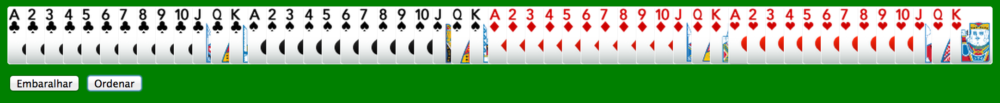

# Embaralhador

Este repositório contém informações e passos para a criação do embaralhador.

## Objetivo

Criar um embaralhador de cartas utilizando apenas html, javascript e css, sem o uso de frameworks.

## Instruções

Realizar um fork deste projeto para o seu GitHub pessoal.

Executar as issues do repositório, seguindo a sua ordem numérica (#). Ao completar uma issue, enviar um pull request com a respectiva solução.

Deverá ser utilizada a estrutura de pastas já presente no projeto, criando os arquivos necessários nas mesmas. O “index.html” deverá estar localizado na raiz.
Em todo o processo é permitida consulta (google e afins), contanto que não seja à pessoas diretas.

Boa sorte ;)
